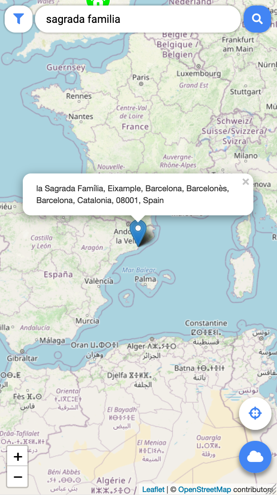

# MyMap

MyMap lets users create their personal trip maps, where they can save locations along with descriptions and personally chosen icons. It also includes support for toggling weather report data for marked locations.

MyMap is designed to work with the [MapBack](https://github.com/datalowe/mapback) API. It uses [Mithril](https://mithril.js.org/) and [Cordova](https://cordova.apache.org/) for delivering WebView-based Android/iOS applications.

This is a project developed for the course [Web Applications for Mobile Devices](https://www.bth.se/utbildning/program-och-kurser/kurser/20231/BJQE4/) at Blekinge Institute of Technology. You can [try out a demo here](https://www.student.bth.se/~loal20/dbwebb-kurser/webapp/me/kmom10/mymap) by logging in with username 'demouser' and password 'demopass' - you might need to wait 1-2 minutes for the login to succeed, as the backend service, served on Heroku, might have been idling. If you want to read about the project in detail, you can have a look at the report I created [here](https://www.student.bth.se/~loal20/dbwebb-kurser/webapp/me/redovisa/) (go to "Reports" and scroll all the way down to "Course project: MyMap").

## Usage overview
MyMap gets rid of clutter and lets you plan your trip, your way!

To get started, register an account and you'll be shown a world map, where you can pan the view by sliding your finger on the screen, or zooming in/out by pinching the screen or fanning out your fingers. [NOTE: I've also created a 'demo account', with username 'demouser' and password 'demopass', with a few locations already added]

Try using the **address search field** at the top to search for a place by address - any hits will be displayed with markers. Tapping markers once will display their addresses. Once you've found a place you want to visit during your trip, **double tap** the marker!

Double-tapping sends you to a form where you can specify things like place name, address and what icon to use for your custom map marker. Choose the 'significance label' based on what you want the icon to signify - is it someplace you definitely want to go? Is it a convenient place to know about, even though you don't necessarily want to visit it itself, like a restroom or a hospital? Each label has an associated color, which will be used for map markers along with picked icons. Maybe you want a more specific label? To create a new significance label, use the **'plus button'** next to the label picker.

Once you add a custom marker you'll be sent back to the map. Now, try **single-tapping** your marker and you'll see some of the information you added about it. If you see anything you want to change, you can double tap the marker and update its information.

Sometimes you might **not have an address**, say for a spot in the middle of a forest. In cases like these, just double tap the spot on the map, and you'll see a black marker with a question mark pop up. Double tap to add a custom marker.

On the map, try tapping the **cloud icon** at the bottom right. Doing this swaps all your markers with weather markers, which show the weather as it is reported to be right now in the corresponding locations. Weather markers can be single-tapped to see the currently reported temperature in degrees Celsius. Tap the cloud icon again when you want to go back to viewing your custom markers.

Right above the cloud icon, there's a **target icon**. If you've enabled location tracking, this lets you move the map view to your current location (shown with a blue target marker).

Another piece of functionality is **filtering**. Tap the sieve/filter icon to the left of the address search field, and you'll be shown the filtering field. If you enter a word here, only markers which hold the word somewhere in their place name, address or description are displayed.

Note that any information you enter is tied to your account. Whether it's markers or labels, whatever you create is for your eyes only.

Lastly, when you've logged in once the app will remember you and send you straight to the map when you open the app back up again later.
